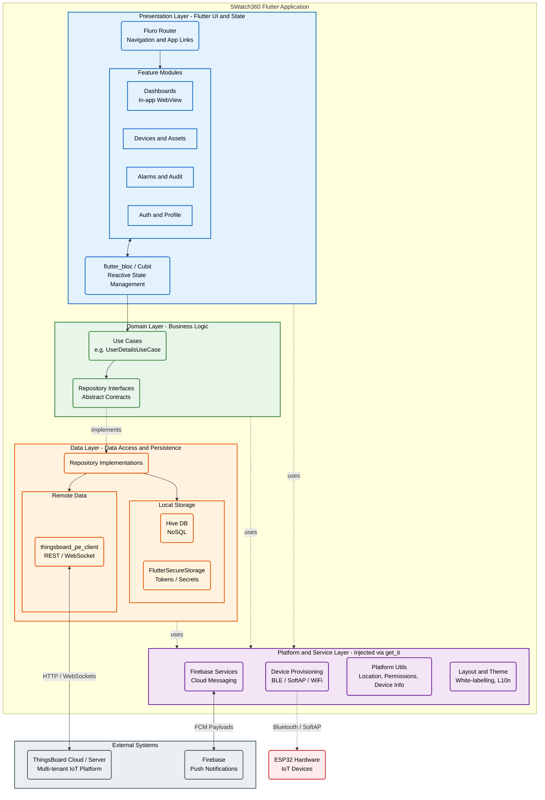

# SWatch360

> **A fully-featured Flutter mobile client for ThingsBoard IoT Platform** — enabling real-time device monitoring, alerting, and management on Android and iOS.

---

## Table of Contents

1. [Problem Statement](#problem-statement)
2. [What It Solves](#what-it-solves)
3. [Key Features](#key-features)
4. [Screenshots](#screenshots)
5. [Architecture Overview](#architecture-overview)
6. [Project File Structure](#project-file-structure)
7. [Tech Stack & Dependencies](#tech-stack--dependencies)
8. [Configuration](#configuration)
9. [Requirements](#requirements)
10. [Setup & Installation](#setup--installation)
11. [Build](#build)
12. [iOS Archive Runbook](#ios-archive-runbook)
13. [Troubleshooting](#troubleshooting)
14. [Contributing](#contributing)
15. [License](#license)

---

## Problem Statement

Industrial and enterprise IoT deployments typically surface their data on a **ThingsBoard** server — a powerful open-source IoT platform that manages devices, telemetry, rules, dashboards, and alerts. However, field engineers, site managers, and end-customers who need instant, on-the-go access to this data face a pain point: the browser-based ThingsBoard interface is not optimised for mobile use, making it cumbersome to monitor equipment, acknowledge alarms, provision new devices, or respond to alerts when away from a desktop.

**SWatch360** fills that gap by delivering the full ThingsBoard experience inside a native Flutter mobile application, purpose-built for touch-first interaction on both Android and iOS.

---

## What It Solves

| Pain Point | SWatch360 Solution |
|---|---|
| No native mobile access to ThingsBoard dashboards | Embedded WebView dashboards that render full ThingsBoard UI inside the app |
| Alert fatigue and missed alarms | Push notifications (Firebase Cloud Messaging) + in-app alarm management with acknowledge/clear actions |
| Device provisioning requires a laptop | BLE and SoftAP Wi-Fi provisioning flows direct from the phone |
| Multi-tenant enterprise setups are hard to navigate | Tenant, customer, and asset hierarchy browsing built-in |
| Slow login on shared devices | Secure token storage (FlutterSecureStorage + Hive), OAuth2, and region-aware endpoint switching |
| No audit trail visibility on mobile | Full audit log browser with pagination |
| No deep-link support | `app_links` package handles universal links and custom URL schemes from emails / SMS |

---

## Key Features

- **Authentication** — Username/password login, OAuth2 social login, sign-up flow, password reset, and no-auth (public dashboard) access.
- **Dashboards** — Browse and open ThingsBoard dashboards rendered in a full-screen in-app WebView with bi-directional JavaScript bridge for mobile actions.
- **Devices** — Paginated device list, device profile browsing (grid/list), device detail page.
- **Device Provisioning** — BLE provisioning (`flutter_esp_ble_prov`) and SoftAP provisioning (`esp_provisioning_softap`) for ESP32-family hardware.
- **Alarms** — Paginated alarm list with filters, acknowledge/clear individual or bulk alarms.
- **Push Notifications** — Firebase Messaging integration with local notification display, badge counts, and tap-to-navigate deep linking.
- **Notifications Center** — In-app notification inbox with read/unread state.
- **Assets** — Asset list and detail views.
- **Customers & Tenants** — Hierarchy browsing for multi-tenant deployments.
- **Audit Logs** — Immutable audit log browser.
- **User Profile** — View and edit profile, change password, avatar upload via image picker.
- **White-labelling** — App title, theme colours, and logo are resolved at runtime from the ThingsBoard white-label API (`wl_service.dart`), with local fallback.
- **Localisation** — Full `flutter_localizations` + `intl` L10n support (ARB-based via `lib/l10n/`).
- **Responsive Layout** — Screen size and orientation aware layout service.

---

## Screenshots

<p float="left">
  
  
  
</p>

---

## Architecture Overview

SWatch360 follows a **Clean Architecture + BLoC** pattern, with dependency injection provided by `get_it`.



### Dependency Injection

All singleton and factory services are registered in `lib/locator.dart` using `get_it`. The registration order is:

```
TbLogger → IOverlayService → IDeviceInfoService → TbContext
→ ThingsboardAppRouter → TbStorage → ILocalDatabaseService
→ IEndpointService → IFirebaseService → ICommunicationService
→ IUserService → IPermissionService → ILayoutService
→ UserDetailsUseCase (factory)
```

### Navigation

`fluro` is used as the route generator. Each feature module exports its own `*_routes.dart` file that registers named routes. All routes are aggregated in `lib/config/routes/router.dart`.

### State Management

Feature screens use `flutter_bloc` (BLoC/Cubit) for reactive state. An `AppBlocObserver` in `lib/app_bloc_observer.dart` logs all BLoC transitions in debug/verbose mode.

---

## Project File Structure

```
SWatch360/
├── assets/
│   ├── branding/          # Splash screen + branded assets (splash.png, logo)
│   └── images/            # General UI images (Seple-logo.png, etc.)
│
├── android/               # Android platform project
├── ios/                   # iOS platform project (Xcode / CocoaPods)
│
├── lib/
│   ├── main.dart                  # App entry point: Hive init, DI setup, Firebase, AppLinks
│   ├── thingsboard_app.dart       # Root MaterialApp + theme + localisation setup
│   ├── thingsboard_client.dart    # Re-export barrel for thingsboard_pe_client
│   ├── firebase_options.dart      # FlutterFire generated Firebase config
│   ├── locator.dart               # get_it service locator registration
│   ├── app_bloc_observer.dart     # Global BLoC lifecycle logger
│   │
│   ├── config/
│   │   ├── routes/                # fluro router + all route definitions
│   │   └── themes/                # Light/dark ThemeData + white-label theme widget
│   │
│   ├── constants/                 # App-wide constants (environment variables, etc.)
│   │
│   ├── core/
│   │   ├── auth/
│   │   │   ├── auth_routes.dart   # Auth route definitions
│   │   │   ├── login/             # Login page, region selector, BLoC
│   │   │   ├── signup/            # Registration flow
│   │   │   ├── noauth/            # Public/no-auth page
│   │   │   ├── oauth2/            # OAuth2 callback handler
│   │   │   └── web/               # WebView-based auth flows
│   │   ├── context/               # TbContext: shared app context passed through the widget tree
│   │   ├── entity/                # Generic entity list / detail scaffolding widgets
│   │   ├── init/                  # App initialisation helpers
│   │   ├── logger/                # TbLogger wrapper
│   │   └── usecases/              # Core-level use cases (e.g. UserDetailsUseCase)
│   │
│   ├── generated/                 # flutter_gen / intl generated code (do not edit manually)
│   │
│   ├── l10n/                      # ARB localisation files (en, and other locales)
│   │
│   ├── modules/                   # Feature modules (one folder per screen area)
│   │   ├── alarm/                 # Alarm list, acknowledge/clear, BLoC, repository
│   │   │   ├── data/
│   │   │   ├── di/
│   │   │   ├── domain/
│   │   │   └── presentation/
│   │   ├── asset/                 # Asset list and detail
│   │   ├── audit_log/             # Audit log browser
│   │   ├── customer/              # Customer hierarchy
│   │   ├── dashboard/             # Dashboard list + full-screen WebView dashboard
│   │   │   ├── di/
│   │   │   ├── domain/
│   │   │   └── presentation/
│   │   ├── device/                # Device list, profiles, details, BLE/SoftAP provisioning
│   │   │   └── provisioning/
│   │   ├── home/                  # Home landing page
│   │   ├── layout_pages/          # Generic tab/layout page scaffolding
│   │   ├── main/                  # Main scaffold (bottom navigation, drawer)
│   │   ├── more/                  # "More" menu items
│   │   ├── notification/          # In-app notification inbox
│   │   │   ├── controllers/
│   │   │   ├── di/
│   │   │   ├── repository/
│   │   │   ├── routes/
│   │   │   ├── service/
│   │   │   ├── usecase/
│   │   │   └── widgets/
│   │   ├── profile/               # User profile, change password, avatar
│   │   ├── tenant/                # Tenant browsing
│   │   ├── url/                   # Deep-link / URL handler module
│   │   └── version/               # App version check / update prompt
│   │
│   ├── utils/
│   │   ├── services/
│   │   │   ├── communication/     # Event bus-based inter-component messaging
│   │   │   ├── device_info/       # Platform device info (OS, model, IDs)
│   │   │   ├── device_profile/    # ThingsBoard device profile helpers
│   │   │   ├── endpoint/          # API endpoint resolution & persistence
│   │   │   ├── firebase/          # Firebase initialisation & FCM token management
│   │   │   ├── layouts/           # Screen size / orientation service
│   │   │   ├── local_database/    # Hive + secure storage abstraction
│   │   │   ├── mobile_actions/    # ThingsBoard mobile action handlers (JS bridge)
│   │   │   ├── overlay_service/   # In-app loading overlays
│   │   │   ├── permission/        # Runtime permission requests
│   │   │   ├── provisioning/      # BLE + SoftAP device provisioning orchestration
│   │   │   ├── user/              # Current user state service
│   │   │   ├── notification_service.dart  # FCM + local notification setup
│   │   │   ├── pagination_repository.dart # Generic infinite-scroll repository base
│   │   │   ├── entity_query_api.dart      # ThingsBoard entity search/query helpers
│   │   │   ├── wl_service.dart            # White-labelling / branding service
│   │   │   ├── _tb_secure_storage.dart    # FlutterSecureStorage adapter
│   │   │   └── tb_app_storage.dart        # Storage factory (mobile vs web)
│   │   ├── transition/            # Custom page transition animations
│   │   ├── ui/                    # UI utility helpers
│   │   ├── string_utils.dart
│   │   ├── translation_utils.dart
│   │   ├── usecase.dart           # Abstract UseCase base class
│   │   ├── ui_utils_routes.dart
│   │   └── utils.dart             # Misc shared utilities
│   │
│   └── widgets/                   # Shared reusable widgets
│
├── test/                          # Unit and widget tests
├── configs.json                   # Build-time configuration (API endpoint, app IDs)
├── pubspec.yaml                   # Flutter project manifest + dependencies
├── analysis_options.yaml          # Dart/Flutter lint rules
├── flutter_native_splash.yaml     # Splash screen generation config
└── devtools_options.yaml          # Flutter DevTools settings
```

---

## Tech Stack & Dependencies

### Core Framework
| Package | Purpose |
|---|---|
| Flutter `^3.x` / Dart `^3.7.0` | UI framework |
| `thingsboard_pe_client ^4.0.0` | ThingsBoard REST & WebSocket API client |

### State Management & DI
| Package | Purpose |
|---|---|
| `flutter_bloc ^8.1.5` | BLoC/Cubit state management |
| `get_it ^7.6.7` | Service locator / dependency injection |
| `equatable ^2.0.5` | Value equality for BLoC states/events |

### Navigation
| Package | Purpose |
|---|---|
| `fluro ^2.0.5` | Named route navigation |
| `app_links ^6.3.2` | Deep link / universal link handling |

### Persistence
| Package | Purpose |
|---|---|
| `hive ^2.2.3` + `hive_flutter` | Fast local NoSQL storage |
| `flutter_secure_storage ^9.0.0` | Encrypted key-value storage for tokens |

### Push Notifications
| Package | Purpose |
|---|---|
| `firebase_core ^3.1.0` | Firebase SDK bootstrap |
| `firebase_messaging ^15.0.1` | FCM push notification receiving |
| `flutter_local_notifications ^17.1.2` | Local notification display + tap routing |
| `flutter_new_badger ^1.0.1` | App icon badge count |

### UI & Widgets
| Package | Purpose |
|---|---|
| `google_fonts ^6.2.1` | Custom fonts |
| `flutter_svg ^2.0.9` | SVG rendering |
| `jovial_svg ^1.1.19` | Extended SVG support |
| `auto_size_text ^3.0.0` | Text that auto-scales |
| `infinite_scroll_pagination ^4.0.0` | Paginated list views |
| `flutter_html 3.0.0-beta.2` | Render HTML content |
| `flutter_widget_from_html ^0.16.0` | Full HTML widget renderer |
| `modal_bottom_sheet ^3.0.0` | iOS-style bottom sheets |
| `flutter_slidable ^4.0.0` | Swipe-to-action list items |
| `toastification ^2.3.0` | Toast/snackbar notifications |
| `super_tooltip ^2.1.0` | Rich tooltip overlays |
| `expandable ^5.0.1` | Expandable/collapsible panels |
| `focused_menu ^1.0.5` | Long-press context menus |
| `flutter_speed_dial ^7.0.0` | Floating action button speed dial |

### Device Provisioning
| Package | Purpose |
|---|---|
| `flutter_esp_ble_prov ^0.1.7` | ESP32 BLE provisioning |
| `esp_provisioning_softap` (git) | ESP32 SoftAP provisioning |
| `wifi_scan ^0.4.1` | Scan for Wi-Fi networks |
| `plugin_wifi_connect` (git) | Connect to a Wi-Fi network |

### Permissions & Platform
| Package | Purpose |
|---|---|
| `permission_handler ^11.3.1` | Runtime permission requests |
| `geolocator ^12.0.0` | GPS/location access |
| `device_info_plus ^10.1.0` | Device model & OS info |
| `package_info_plus ^8.0.0` | App version & build number |
| `image_picker ^1.0.4` | Camera / gallery image selection |
| `file_picker ^9.0.0` | File selection |
| `mobile_scanner ^7.0.1` | QR/barcode scanning |
| `open_settings_plus ^0.4.0` | Open device settings |
| `flutter_inappwebview ^6.1.5` | Full-featured in-app WebView |
| `url_launcher ^6.2.1` | Open URLs in browser/app |
| `recaptcha_enterprise_flutter ^18.6.1` | reCAPTCHA for sign-up |

### Code Generation & Quality
| Package | Purpose |
|---|---|
| `freezed ^3.1.0` + `freezed_annotation` | Immutable data classes |
| `json_serializable ^6.9.5` + `json_annotation` | JSON serialisation |
| `build_runner ^2.4.9` | Code generation runner |
| `flutter_gen ^5.11.0` | Type-safe asset access |
| `flutter_lints`, `custom_lint`, `lint` | Lint rules |
| `bloc_test ^9.1.7`, `mocktail ^1.0.3` | BLoC unit testing |

---

## Configuration

Builds rely on `configs.json` supplied via `--dart-define-from-file`. Create or edit this file **before building**:

```json
{
  "thingsboardApiEndpoint": "https://YOUR-THINGSBOARD-HOST",
  "appLinksUrlHost": "YOUR-THINGSBOARD-HOST",
  "appLinksUrlScheme": "https",
  "registrationRedirectUrlScheme": "tbscheme",
  "registrationRedirectUrlHost": "app.pe.thingsboard.org",
  "androidApplicationId": "com.yourcompany.yourapp",
  "androidApplicationName": "YourAppName",
  "thingsboardOAuth2CallbackUrlScheme": "com.yourcompany.yourapp.auth",
  "thingsboardAndroidAppSecret": "YOUR_APP_SECRET_BASE64"
}
```

> **Security note:** Never commit production secrets to version control. Use CI/CD environment variable injection or a secrets manager instead.

---

## Requirements

### General
- Flutter SDK (stable channel, Dart `^3.7.0`)
- Git

### Android
- Android Studio or Android SDK (`ANDROID_HOME` set)
- Java 17+

### iOS *(macOS only)*
- Xcode (latest stable)
- CocoaPods (`gem install cocoapods`)
- Apple Developer account with a signing certificate and provisioning profile

---

## Setup & Installation

```bash
# 1. Clone the repository
git clone https://github.com/Itinerant18/SWatch360.git
cd SWatch360

# 2. Install Flutter dependencies
flutter pub get

# 3. Run code generation (if you change freezed/json_serializable models)
dart run build_runner build --delete-conflicting-outputs

# 4. iOS only — install CocoaPods dependencies
cd ios
pod install
cd ..
```

---

## Build

### Run in development

```bash
flutter run --dart-define-from-file configs.json
```

### Android APK

```bash
flutter build apk --release --dart-define-from-file configs.json
```

Output: `build/app/outputs/flutter-apk/app-release.apk`

### Android App Bundle (Play Store)

```bash
flutter build appbundle --release --dart-define-from-file configs.json
```

Output: `build/app/outputs/bundle/release/app-release.aab`

### iOS IPA (App Store / TestFlight)

```bash
flutter build ipa --release --dart-define-from-file configs.json
```

Outputs:
- Archive: `build/ios/archive/Runner.xcarchive`
- IPA: `build/ios/ipa/*.ipa`

---

## iOS Archive Runbook

If the archive fails, follow this exact sequence:

**Step 1 — Clean state**
```bash
flutter clean
flutter pub get
cd ios && pod install && cd ..
```

**Step 2 — Verify Xcode project settings**

- `ENABLE_USER_SCRIPT_SANDBOXING = NO` in Runner build settings
- `StoreKit.framework` linked in Frameworks (not embedded)
- `Podfile` post-install block has:
  ```ruby
  config.build_settings['ENABLE_MODULE_VERIFIER'] = 'NO'
  config.build_settings['CLANG_WARN_QUOTED_INCLUDE_IN_FRAMEWORK_HEADER'] = 'NO'
  ```

**Step 3 — Archive**
```bash
flutter build ipa --release --dart-define-from-file configs.json
```

---

## Troubleshooting

### No space left on device (Xcode caches)

```bash
rm -rf ~/Library/Developer/Xcode/DerivedData/*
rm -rf ~/Library/Developer/Xcode/iOS\ DeviceSupport/*
rm -rf build/ios/*
df -h /
```

### Understanding build output

| Output type | Action required |
|---|---|
| Deprecation warnings in Pods | None — warnings only |
| iOS deployment target warnings from third-party pods | None — warnings only |
| Dart compile errors in `lib/` | **Fix before building** |
| `No space left on device` | Clear Xcode caches (see above) |
| Framework embed errors | Fix Xcode embed settings |

---

## Contributing

Contributions are welcome! Please follow these steps:

1. **Fork** the repository and create a feature branch from `main`:
   ```bash
   git checkout -b feature/my-feature
   ```

2. **Explore the codebase structure** — each feature lives in `lib/modules/<feature>/` and is split into `data/`, `domain/`, `presentation/`, and `di/` layers following Clean Architecture.

3. **Code style** — the project enforces `flutter_lints` + `custom_lint`. Run the analyser before opening a PR:
   ```bash
   flutter analyze
   ```

4. **Tests** — add or update tests in `test/`. Run:
   ```bash
   flutter test
   ```

5. **Code generation** — if you add or modify `freezed` / `json_serializable` annotated classes, regenerate:
   ```bash
   dart run build_runner build --delete-conflicting-outputs
   ```

6. **Commit** using a descriptive message and open a Pull Request against `main`.

### Module Conventions

When adding a new feature module:

- Create `lib/modules/<feature>/` with subdirectories: `data/`, `domain/`, `di/`, `presentation/`
- Add a `<feature>_routes.dart` and register its routes in `lib/config/routes/router.dart`
- Register any new services/repositories in `lib/locator.dart`
- Expose public API through the module's `di/` folder

---

## License

This project is licensed under the terms of the [LICENSE](LICENSE) file included in this repository.
